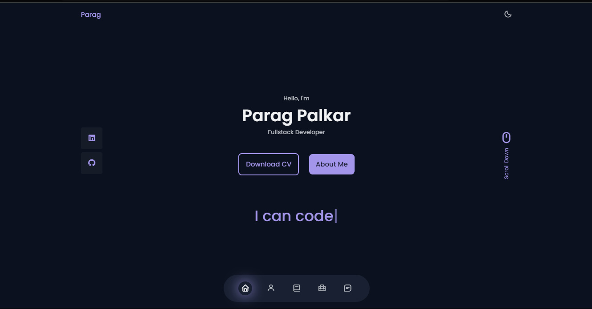

# Portfolio

Welcome to the Portfolio website! This repository contains a powerful and responsive website built using HTML, CSS, CSS Grid, and JavaScript. This project aims to showcase the capabilities of these advanced techniques in creating modern and efficient user interfaces.

## Demo

https://paragpalkar.github.io/portfolio/

## Features

- CSS Grid Layout
- Flexbox for Components
- Fullscreen mode
- User-Friendly Interface

## Tech Stack

## Preview

## Contributing

Contributions are always welcome!

